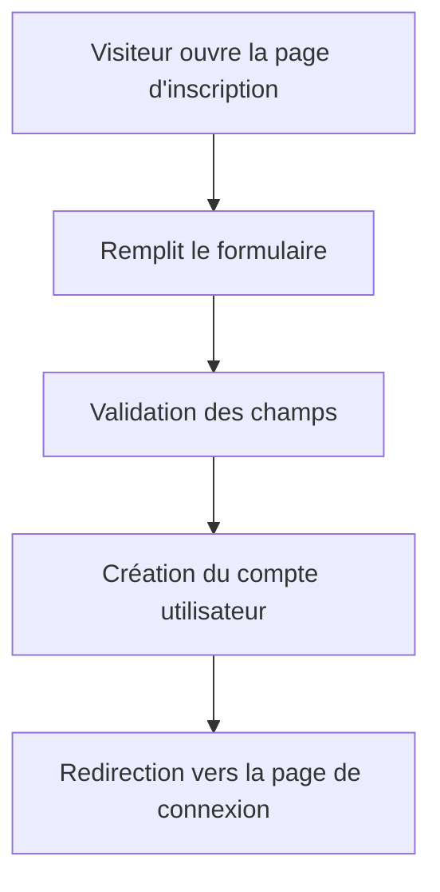
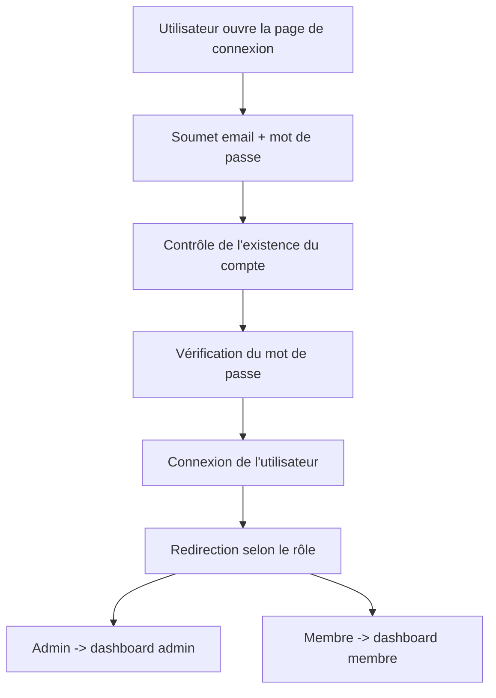
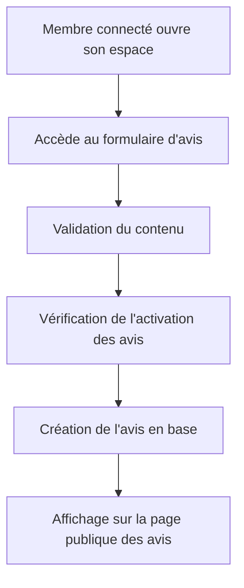
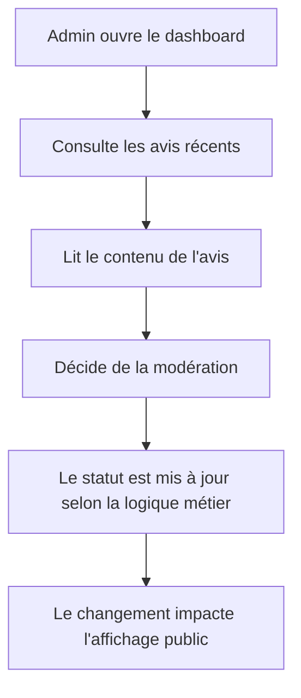
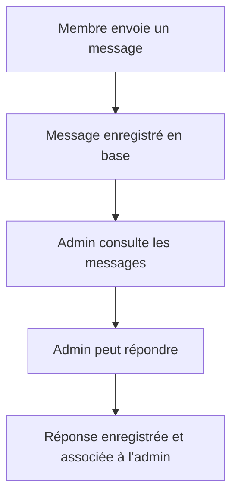

# Document de handover – WellBeing

> Ce document a pour vocation de transmettre de façon claire et structurée les fondements techniques, fonctionnels et organisationnels du projet WellBeing à un autre développeur, à une équipe de maintenance ou à un partenaire externe.

## Sommaire
- [1. Document de handover pour développeur](#1-document-de-handover-pour-développeur)
- [2. Architecture technique détaillée](#2-architecture-technique-détaillée)
- [3. Schéma des flux utilisateur](#3-schéma-des-flux-utilisateur)
- [4. Guide de maintenance du projet](#4-guide-de-maintenance-du-projet)

## 1. Document de handover pour développeur

### 1.1 Objectif du projet
WellBeing est une application web Laravel destinée à une association de bien-être. Elle permet de :
- présenter l’organisation et ses programmes,
- permettre aux membres d’interagir avec la plateforme,
- offrir un espace administrateur de supervision,
- gérer les avis, messages et paramètres système.

### 1.2 Vision fonctionnelle
Le projet a été conçu comme une application de type “vitrine + espace membre + back-office léger”.

Les acteurs principaux sont :
- Visiteur : consulte la vitrine publique.
- Membre : consulte son espace, publie des avis et envoie des messages.
- Administrateur : supervise les données et gère les paramètres du système.

### 1.3 Stack technique
- PHP 8.2+
- Laravel 12
- Blade templates
- Bootstrap
- MySQL / SQLite (selon environnement)
- Composer + npm

### 1.4 Structure fonctionnelle du projet
- Front office : pages publiques, avis publics, pages de programme.
- Back office : dashboard admin, gestion des profils, gestion des avis et messages.
- Authentification : inscription / connexion / accès par rôle.
- Base de données : utilisateurs, avis, messages, services, paramètres système.

### 1.5 Points d’entrée principaux
- Routes publiques : [routes/web.php](../routes/web.php)
- Contrôleurs principaux :
  - [app/Http/Controllers/AdminController.php](../app/Http/Controllers/AdminController.php)
  - [app/Http/Controllers/MemberController.php](../app/Http/Controllers/MemberController.php)
  - [app/Http/Controllers/AvisController.php](../app/Http/Controllers/AvisController.php)
- Vues principales :
  - [resources/views/admin/dashboard.blade.php](../resources/views/admin/dashboard.blade.php)
  - [resources/views/membre/dashboard.blade.php](../resources/views/membre/dashboard.blade.php)
  - [resources/views/avis/list.blade.php](../resources/views/avis/list.blade.php)

### 1.6 Règles de développement à respecter
- Préférer la logique métier dans les contrôleurs ou services, pas directement dans les vues.
- Utiliser les migrations pour toute modification de schéma.
- Maintenir la séparation entre logique métier, présentation et accès aux données.
- Préserver la cohérence du système d’authentification par rôle.

### 1.7 Environnements de travail
Configuration recommandée :
- PHP 8.2+
- Composer installé
- Node.js + npm
- Base de données disponible

Commandes d’installation rapides :
```bash
composer install
cp .env.example .env
php artisan key:generate
php artisan migrate --seed
npm install
npm run build
```

### 1.8 État actuel du projet
Le projet est fonctionnel sur une base Laravel classique et présente déjà :
- l’authentification,
- l’espace membre,
- l’espace administrateur,
- la gestion des avis,
- la gestion des messages,
- les paramètres système.

Il reste toutefois des améliorations possibles sur :
- la conformité UX des tableaux de bord,
- l’ergonomie de la gestion des avis côté admin,
- la standardisation des vues Blade,
- la factorisation de certaines parties de logique répétée.

---

## 2. Architecture technique détaillée

### 2.1 Architecture générale
Le projet suit un pattern MVC traditionnel avec Laravel :
- Routes : réception des requêtes HTTP
- Contrôleurs : orchestration de la logique métier
- Modèles Eloquent : représentation des données
- Vues Blade : rendu HTML
- Services : logique réutilisable et centralisée

### 2.2 Couche de présentation
Les vues sont dans [resources/views](../resources/views).

Exemples :
- [resources/views/index.blade.php](../resources/views/index.blade.php) : page d’accueil publique
- [resources/views/admin/dashboard.blade.php](../resources/views/admin/dashboard.blade.php) : dashboard admin
- [resources/views/membre/dashboard.blade.php](../resources/views/membre/dashboard.blade.php) : dashboard membre
- [resources/views/avis/list.blade.php](../resources/views/avis/list.blade.php) : page de consultation des avis

### 2.3 Couche applicative
Les contrôleurs sont dans [app/Http/Controllers](../app/Http/Controllers).

Principaux contrôleurs :
- [app/Http/Controllers/AdminController.php](../app/Http/Controllers/AdminController.php)
  - gère les tableaux de bord admin,
  - affiche les statistiques,
  - récupère les avis/messages récents,
  - gère les paramètres système.
- [app/Http/Controllers/MemberController.php](../app/Http/Controllers/MemberController.php)
  - gère l’espace membre,
  - prépare les données du dashboard membre.
- [app/Http/Controllers/AvisController.php](../app/Http/Controllers/AvisController.php)
  - gère l’affichage, la création et la mise à jour des avis.

### 2.4 Couche métier et services
Le service [app/Services/WellBeingProgramService.php](../app/Services/WellBeingProgramService.php) centralise :
- la liste des axes du programme,
- les objectifs associés,
- les métriques de tableau de bord.

Le but est d’éviter que la logique liée aux programmes ne soit dispersée dans les vues ou contrôleurs.

### 2.5 Couche données
Modèles principaux :
- [app/Models/User.php](../app/Models/User.php)
- [app/Models/Avis.php](../app/Models/Avis.php)
- [app/Models/Message.php](../app/Models/Message.php)
- [app/Models/Service.php](../app/Models/Service.php)
- [app/Models/SystemSetting.php](../app/Models/SystemSetting.php)

Principales entités :
- User : utilisateur du système, avec rôle admin ou membre
- Avis : commentaire publié par un membre
- Message : communication interne / publique selon le contexte
- Service : service proposé par l’association
- SystemSetting : paramètres dynamiques du système

### 2.6 Base de données
Les migrations sont dans [database/migrations](../database/migrations).

Migrations clés :
- [database/migrations/2026_07_04_195837_create_avis_table.php](../database/migrations/2026_07_04_195837_create_avis_table.php)
- [database/migrations/2026_07_08_000000_create_messages_table.php](../database/migrations/2026_07_08_000000_create_messages_table.php)
- [database/migrations/2026_07_04_171918_create_services_table.php](../database/migrations/2026_07_04_171918_create_services_table.php)

### 2.7 Gestion des rôles et permissions
Le rôle est défini par l’enum [app/Enums/Role.php](../app/Enums/Role.php).

Les contrôleurs vérifient l’accès par rôle avec des contrôles de sécurité simples et explicites.

### 2.8 Sécurité de base
Le projet utilise :
- Laravel Auth
- validation des formulaires côté contrôleur
- protection des routes par middleware auth
- hachage des mots de passe

Les points à renforcer à l’avenir :
- autorisations plus granulaires,
- validation plus stricte des entrées,
- logs d’audit,
- politique d’accès centralisée.

---

## 3. Schéma des flux utilisateur

### 3.1 Flux d’inscription


### 3.2 Flux de connexion


### 3.3 Flux de publication d’un avis


### 3.4 Flux de modération admin


### 3.5 Flux de messagerie


---

## 4. Guide de maintenance du projet

### 4.1 Maintenance courante
À chaque évolution, vérifier au minimum :
- que les routes sont cohérentes,
- que les contrôleurs n’envoient plus de données inutiles,
- que les vues restent compatibles avec les variables passées,
- que les migrations ne cassent pas la base existante.

### 4.2 Mise à jour de la base de données
Quand une modification du modèle est nécessaire :
1. créer une migration,
2. exécuter `php artisan migrate`,
3. vérifier la cohérence des données existantes,
4. mettre à jour les modèles si nécessaire.

Exemple :
```bash
php artisan make:migration add_column_to_table
php artisan migrate
```

### 4.3 Débogage
En cas de problème :
- vérifier les logs Laravel dans [storage/logs](../storage/logs),
- vérifier la configuration de [.env](../.env),
- nettoyer le cache si nécessaire :
```bash
php artisan config:clear
php artisan route:clear
php artisan view:clear
php artisan cache:clear
```

### 4.4 Tableau de bord de contexte technique

| Domaine | État actuel | Niveau de maturité | Observation |
| --- | --- | --- | --- |
| Architecture | Laravel MVC classique | Moyen | Structure claire et compréhensible |
| Authentification | Implémentée | Moyen | Fonctionnelle, mais à renforcer |
| Gestion des avis | Implémentée | Moyen | Logique de base bien en place |
| Gestion des messages | Implémentée | Moyen | Fonctionnelle, mais encore simple |
| Administration | Implémentée | Moyen | Dashboard utile, encore perfectible UX |
| Design / UX | Partiellement structuré | Moyen | Basé sur Bootstrap et templates Blade |
| Tests automatisés | Limités | Faible | À renforcer pour la robustesse |
| Extensibilité | Bonne base | Moyen | Le projet peut évoluer sans refonte majeure |

### 4.5 Améliorations à venir

#### Priorité haute
- améliorer l’ergonomie du dashboard admin,
- remplacer certains éléments statiques par des composants Blade réutilisables,
- renforcer la gestion de la modération des avis,
- ajouter des tests automatisés sur les flux clés.

#### Priorité moyenne
- introduire des politiques d’accès plus fines,
- améliorer la cohérence visuelle entre les vues,
- centraliser davantage la logique métier dans des services,
- ajouter une meilleure gestion des erreurs utilisateur.

#### Priorité basse
- mettre en place une API plus structurée,
- ajouter une couche de notification avancée,
- préparer une version plus robuste pour une mise en production complète.

### 4.6 Version orientée recrutement et handover client

#### Valeur métier
WellBeing est un projet orienté produit et impact utilisateur. Il répond à un besoin réel : offrir une plateforme simple, moderne et fonctionnelle à une association qui souhaite mieux structurer sa présence en ligne et ses interactions avec ses membres.

#### Valeur technique
Le projet démontre une capacité à :
- construire une application Laravel complète,
- organiser une architecture MVC propre,
- gérer des rôles utilisateurs,
- travailler sur des workflows métier concrets comme les avis et la messagerie,
- produire une base maintenable pour une évolution future.

#### Positionnement pour un recruteur ou un client
Ce projet peut être présenté comme :
- une application web Laravel fonctionnelle et cohérente,
- un socle technique évolutif,
- un exemple de développement full-stack orienté produit,
- une base solide pour une transformation vers une plateforme plus complète et plus robuste.

### 4.7 Tests
Le projet contient déjà une base de tests Laravel dans [tests](../tests).

À ajouter lors de l’évolution du projet :
- tests d’authentification,
- tests d’accès par rôle,
- tests de création d’avis,
- tests d’affichage admin/membre.

### 4.5 Maintenance des vues Blade
Les vues doivent rester simples et lisibles. En cas de duplication :
- factoriser le HTML commun,
- créer des composants Blade si nécessaire,
- éviter de mettre trop de logique métier dans les templates.

### 4.6 Maintenance des performances
À surveiller :
- nombre de requêtes SQL dans les pages critiques,
- logique de chargement des listes,
- usage excessif de `with()` et de chargements Eloquent inutiles,
- volume de données dans les tableaux de bord.

### 4.7 Recommandations d’évolution
À court terme :
- uniformiser le rendu des dashboards,
- remplacer certains éléments statiques par des composants réutilisables,
- centraliser davantage la logique d’affichage des avis,
- ajouter un système de modération plus avancé.

À moyen terme :
- introduire des policies plus fines,
- ajouter des tests automatisés,
- mettre en place une API plus structurée,
- améliorer la gestion des permissions et des notifications.

### 4.8 Checklist avant livraison d’une évolution
Avant de livrer une modification, vérifier :
- l’application démarre correctement,
- les routes concernées sont accessibles,
- les permissions sont respectées,
- les vues se chargent sans erreur,
- les migrations fonctionnent proprement,
- les données existantes ne sont pas corrompues.

---

## 5. Résumé exécutif
WellBeing est un projet Laravel de taille modérée, construit autour d’une architecture MVC traditionnelle. Son cœur fonctionnel repose sur :
- l’authentification et les rôles,
- la gestion des avis,
- la messagerie,
- l’administration des données,
- la présentation des programmes et services.

Le projet est assez clair à comprendre pour un développeur Laravel, mais il reste encore perfectible sur l’ergonomie, la modularité et la robustesse fonctionnelle.
